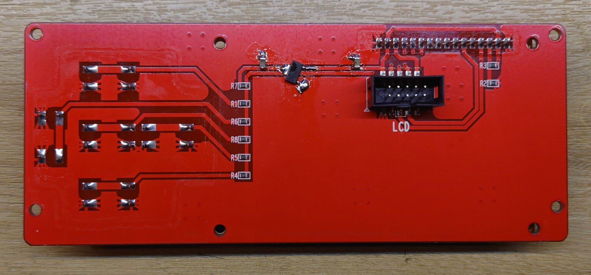

# Marlin Firmware for Anet A8 3D printer with BIGTREETECH SKR V1.3

This repository contains the Marlin firmware for an Anet A8 with a BTT SKR V1.3 motherboard.

  - `Marlin version`: 2.1.2.5
  - `Stepper motor drivers`: TMC2130 (SPI mode)
  - `Screen`: Original LCD screen with working keypad :warning: requires an hardware modification to not damage the motherboard (see below) :warning:
  - `Micro SD card`: allows updating the firmware and to print from SD card
  - `Language`: compiled files for English and French, for other languages you will need to compile the firmware
  
## Motherboard

Follow the BIGTREETECH SKR V1.3 documentation to set the jumpers on the motherboard accordingly.

The stepper motor drivers must be configured to work in SPI mode (may require soldering if not pre-configured correctly).

Wiring connectors needs to be adjusted for the motherboard.

## LCD screen

As the analogue pin of the LPC1768 are not 5V tolerant, you need to modify the screen to not damage the motherboard. I cut the 5V trace going to the keypad and soldered a 3.3V regulator (AZ1117CH-3.3TRG1) with its required capacitors (22uF) (see picture below). With this modification, the voltage for the keypad is 3.3V while the LCD screen is still powered with 5V.



You will also need to modify the wiring of the ribbon cable. For that, I added dupont wires on one side to keep the original ribbon cable.

```
┌─────────────┐
|             |
│ +5V     GND │
│ 1.23   1.22 │
│ 1.21   1.20
│ 1.19   1.18 │
│ 0.28   1.30 │
|             |
└─────────────┘
```
Motherboard SKR 1.3 - EXP1 connector

```
┌─────────────┐
|             |
│ D7   KEYPAD │
│ D6       EN │
│ D5       RS
│ D4       NC │
│ +5V     GND │
|             |
└─────────────┘
```
Anet A8 LCD connector

Before connecting the screen to the motherboard, check the wiring and voltage of the keypad with a multimeter. Ideally, test the screen with a lab power supply to do your measurements.

### Additional information

KEYPAD must be connected to 1.30 as 1.30 is the only analogue pin on EXP1.

Connection table:

| LCD    | EXP1 (motherboard) |
|--------|--------------------|
| D7     | 0.28               |
| D6     | 1.19               |
| D5     | 1.21               |
| D4     | 1.23               |
| +5V    | +5V                |
| KEYPAD | 1.30               |
| EN     | 1.18               |
| RS     | 1.20               |
| NC     | 1.22               |
| GND    | GND                |


## Compile the firmware (optional)

Download Marlin 2.1.2.5 (or the newer non-major release), and replace the following configuration files by the ones of this repository:

  - `Marlin/Configuration.h` (in `en/` or `fr/`)
  - `Marlin/Configuration_adv.h`
  - `Marlin/src/HAL/LPC1768/HAL.h`
  - `Marlin/src/pins/lpc1768/pins_BTT_SKR_V1_3.h`
  - `platformio.ini`

Install platformio, compile, and copy the file `.pio/build/LPC1768/firmware.bin` to the micro SD card.


## Upload the firmware

Copy the file `firmware.bin` (in `en/` or `fr/`) and put it on a micro SD card. Insert the micro SD while the 3D printer is powered off and the firmware will be updated at the next startup.


Romain THOMAS 2025
